---
## Front matter
lang: ru-RU
title: Внешний курс, второй раздел
subtitle: Основы информационной безопасности
author:
  - Стрижов Д. П.
institute:
  - Российский университет дружбы народов, Москва, Россия
date: 17 май 2025

## i18n babel
babel-lang: russian
babel-otherlangs: english

## Formatting pdf
toc: false
toc-title: Содержание
slide_level: 2
aspectratio: 169
section-titles: true
theme: metropolis
header-includes:
 - \metroset{progressbar=frametitle,sectionpage=progressbar,numbering=fraction}
---

# Цель работы

Пройти второй блок курса "Основы кибербезопасности"

# Выполнение блока 2: Защита ПК/Телефона

## Шифрование диска

Шифрование диска — технология защиты информации, переводящая данные на диске в нечитаемый код, который нелегальный пользователь не сможет легко расшифровать. Соответственно, можно (рис. [-@fig:001]).

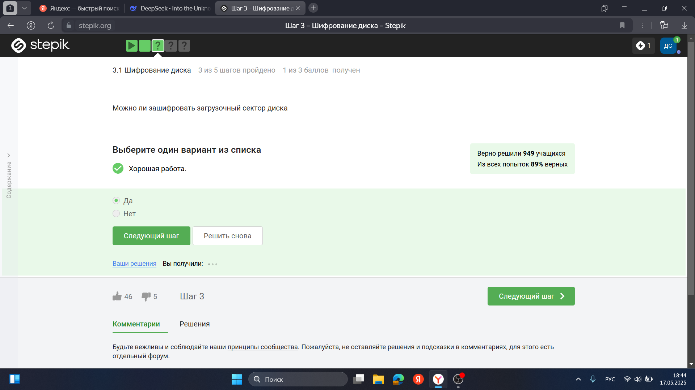{#fig:001 width=70%}

Шифрование диска основано на симметричном шифровании (рис. [-@fig:002]).

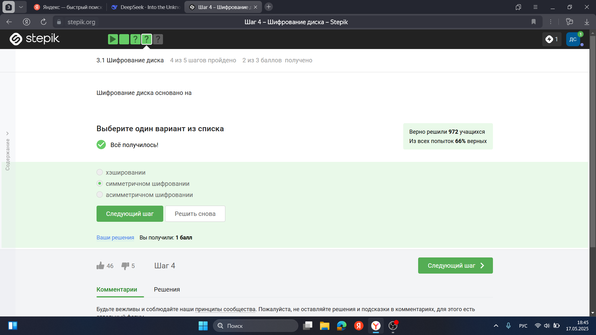{#fig:002 width=70%}

Отмечены программы, с помощью которых можно зашифровать жетский диск (рис. [-@fig:003]).

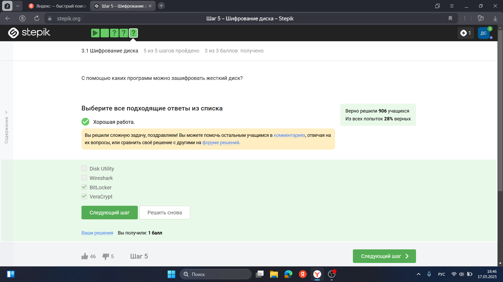{#fig:003 width=70%}

## Пароли

Стойкий пароль - тот, который тяжлее подобрать, он должен быть со спец. символами и длинный (рис. [-@fig:004]).

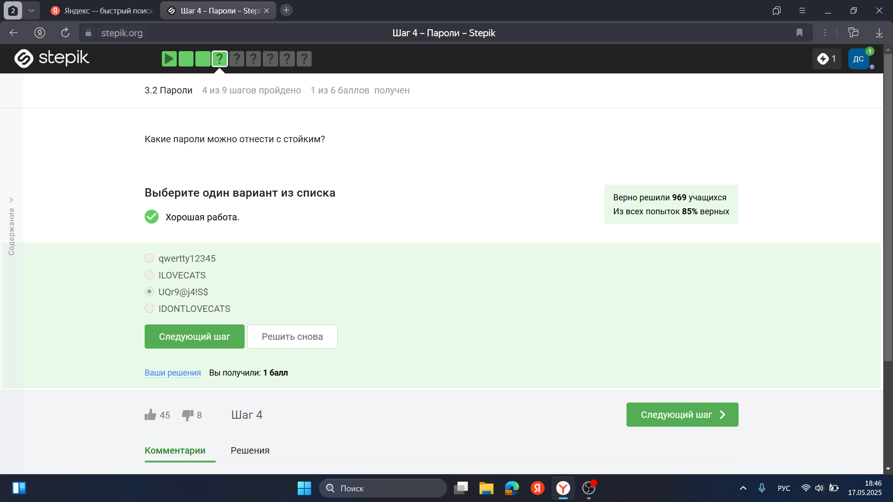{#fig:004 width=70%}

Все варианты, кроме менеджера паролей, совершенно не надежные (рис. [-@fig:005]).

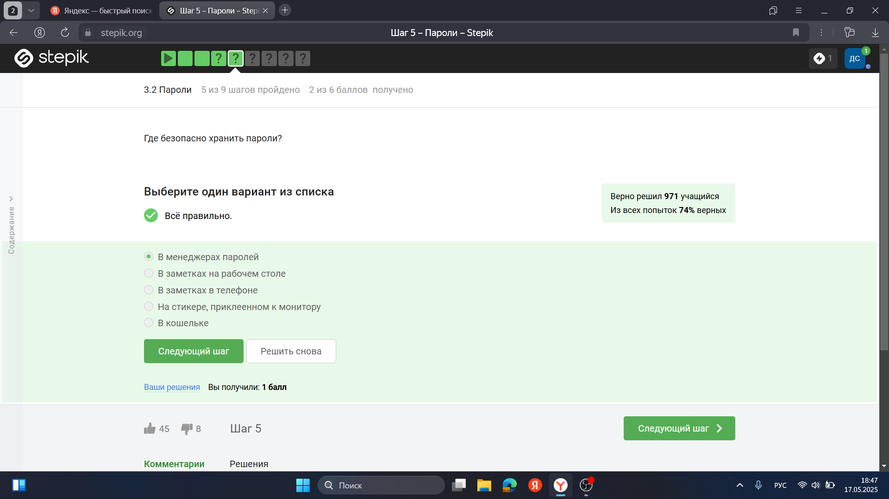{#fig:005 width=70%}

Капча нужна для проверки на то, что за экраном "не робот"(рис. [-@fig:006]).

{#fig:006 width=70%}

Опасно хранить пароли в открытом виде, поэтому хранят их хэши (рис. [-@fig:007]).

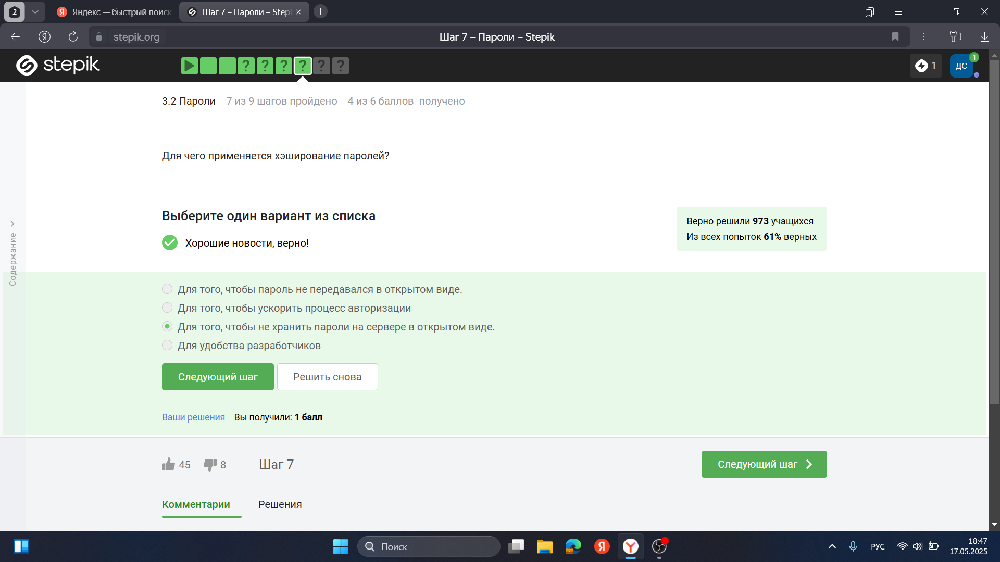{#fig:007 width=70%}

Соль не поможет (рис. [-@fig:008]).

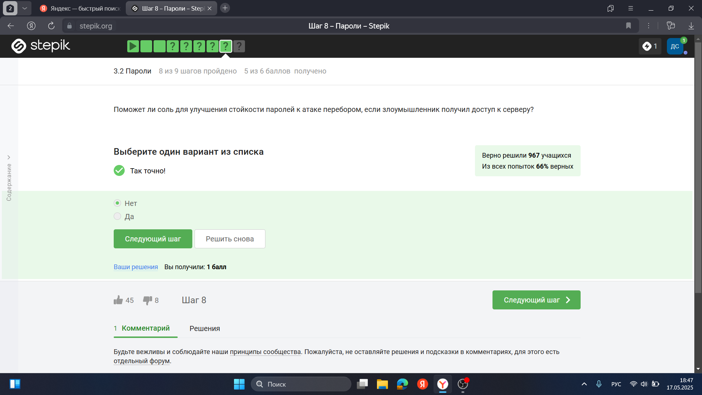{#fig:008 width=70%}

Все приведенные меры защищают от утечек данных (рис. [-@fig:009]).

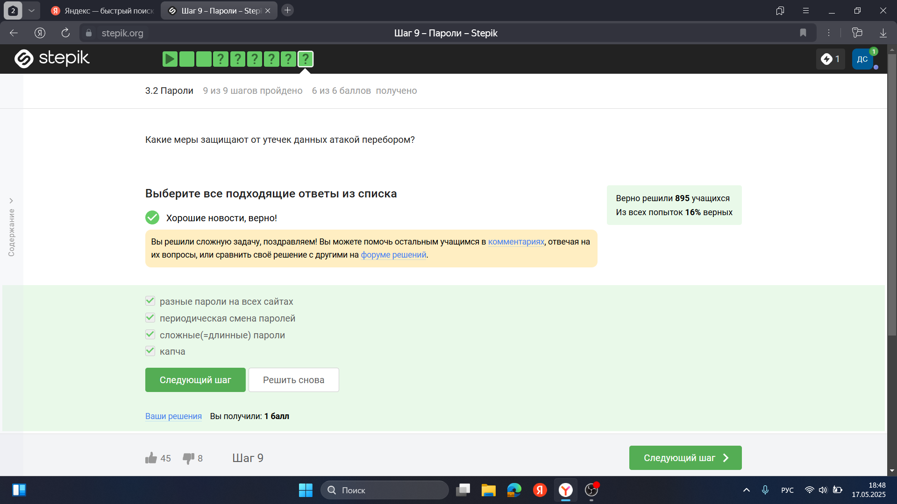{#fig:009 width=70%}

## Фишинг

Фишинговые ссылки очень похожи на ссылки известных сервисов, но с некоторыми отличиями (рис. [-@fig:010]).

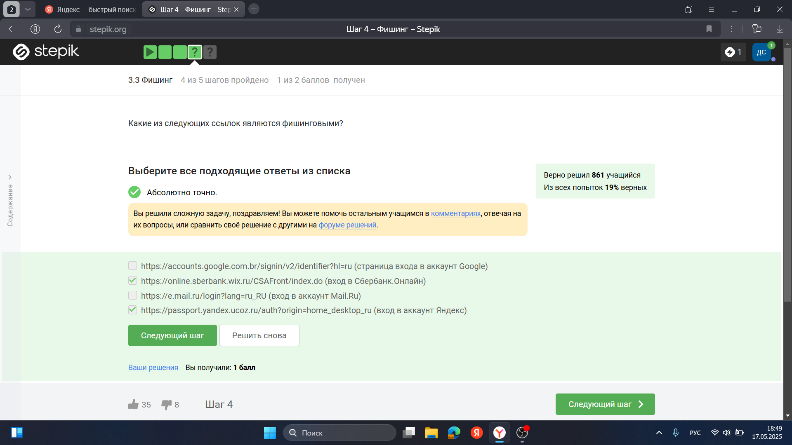{#fig:010 width=70%}

Да, может, например, если пользователя со знакомым адресом взломали (рис. [-@fig:011]).

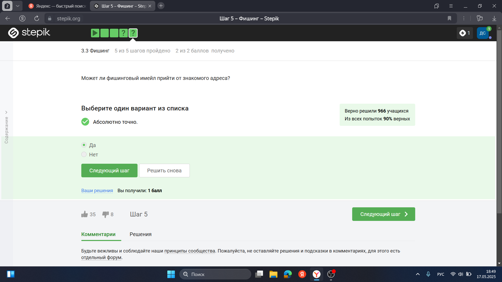{#fig:011 width=70%}

## Вирусы. Примеры

Ответ дан в соответствии с определением (рис. [-@fig:012]).

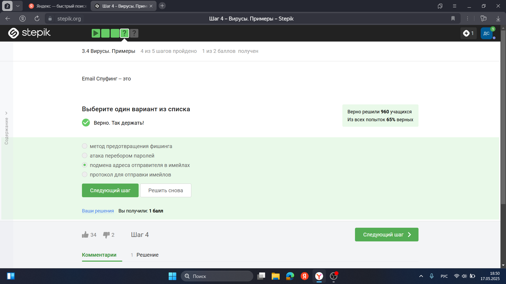{#fig:012 width=70%}

Троян маскируется под обычную программу (рис. [-@fig:013]).

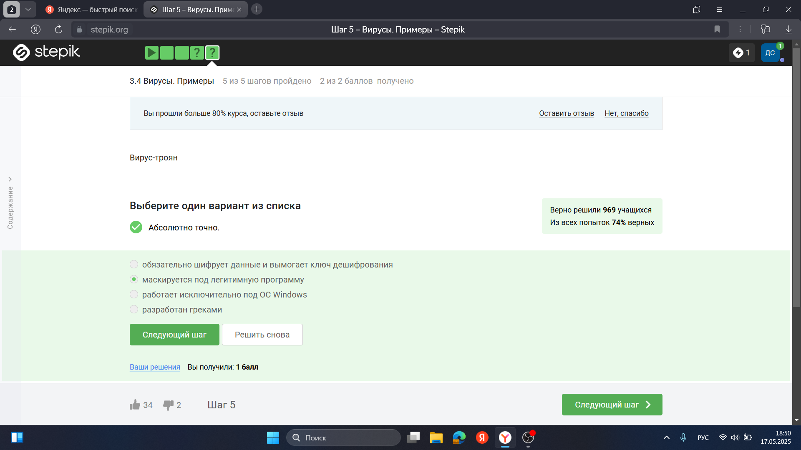{#fig:013 width=70%}

## Безопасность мессенджеров

При установке первого сообщения отправителем формируется ключ шифрования (рис. [-@fig:014]).

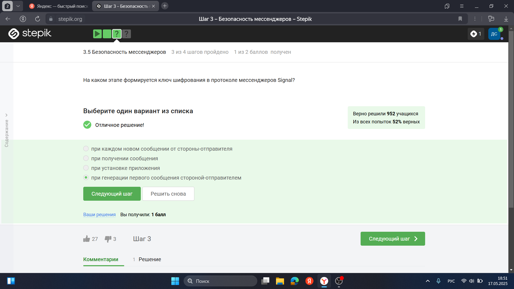{#fig:014 width=70%}

Суть сквозного шифрования состоит в том, что сообзения передаются по узлам связи в зашифрованном виде (рис. [-@fig:015]).

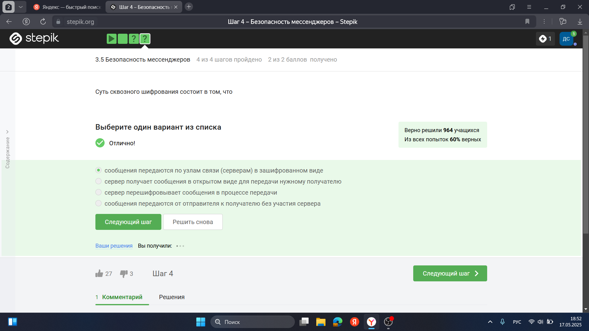{#fig:015 width=70%}

# Выводы

Был пройден второй блок курса "Основы кибербезопасности", изучены правила хранения паролей и основная информация о вирусах
