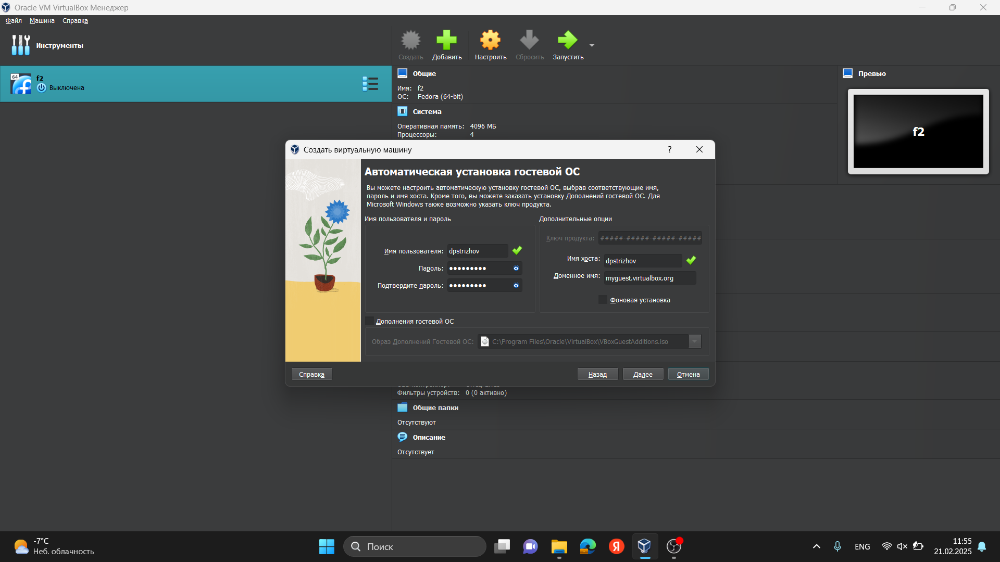
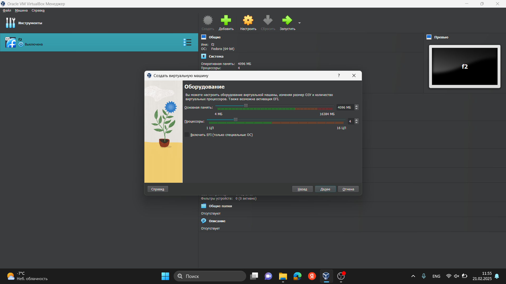
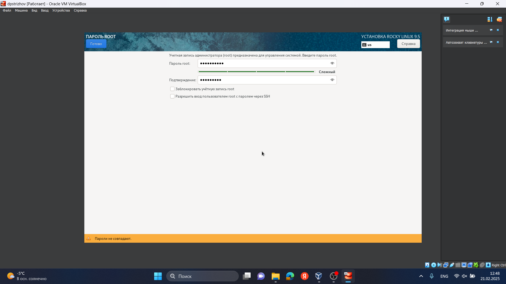
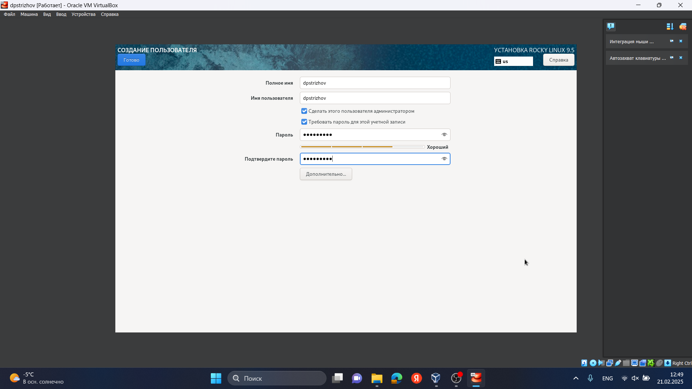
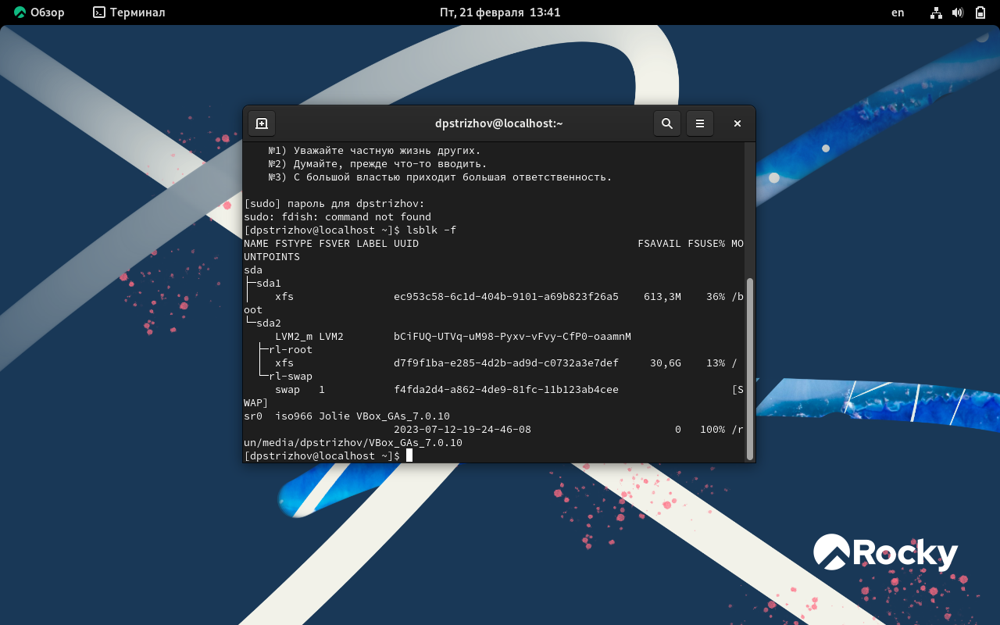

---
## Front matter
lang: ru-RU
title: Отчет по лабораторной работе №1
subtitle: Основы инофрмационной безопасности
author:
  - Стрижов Д. П.
institute:
  - Российский университет дружбы народов, Москва, Россия
date: 01 марта 2025

## i18n babel
babel-lang: russian
babel-otherlangs: english

## Formatting pdf
toc: false
toc-title: Содержание
slide_level: 2
aspectratio: 169
section-titles: true
theme: metropolis
header-includes:
 - \metroset{progressbar=frametitle,sectionpage=progressbar,numbering=fraction}
---

## Цель работы

Целью данной работы является приобретение практических навыков
установки операционной системы на виртуальную машину, настройки ми-
нимально необходимых для дальнейшей работы сервисов.

## Задание

1. Установка Rocky Linux на виртуальную машину
2. Проверка параметров системы через консоль

# Выполнение лабораторной работы

## Указываю папку, в которой будет находится виртуальная машина, выбираю необходимый образ

## Ставлю необходимое наименование хоста и пользователя

## Указываем количество оперативной памяти и ядер процессора

## Выбираем диск, куда будет устанавливатся ОС

## Выбираю нужный регион 

## Настраиваем соединение интернета

## Устанавливаем пароль для администратора

## Настройка пользователя 

## Проверяем версию Линукса 

## Проверяем процессор 

## Провераем Hypervisor 

## Провераем корневую систему 

## Выводы

В ходе данной лабораторной работы я приобрел практические навыки по уставке операционной системы на виртуальную машину.
