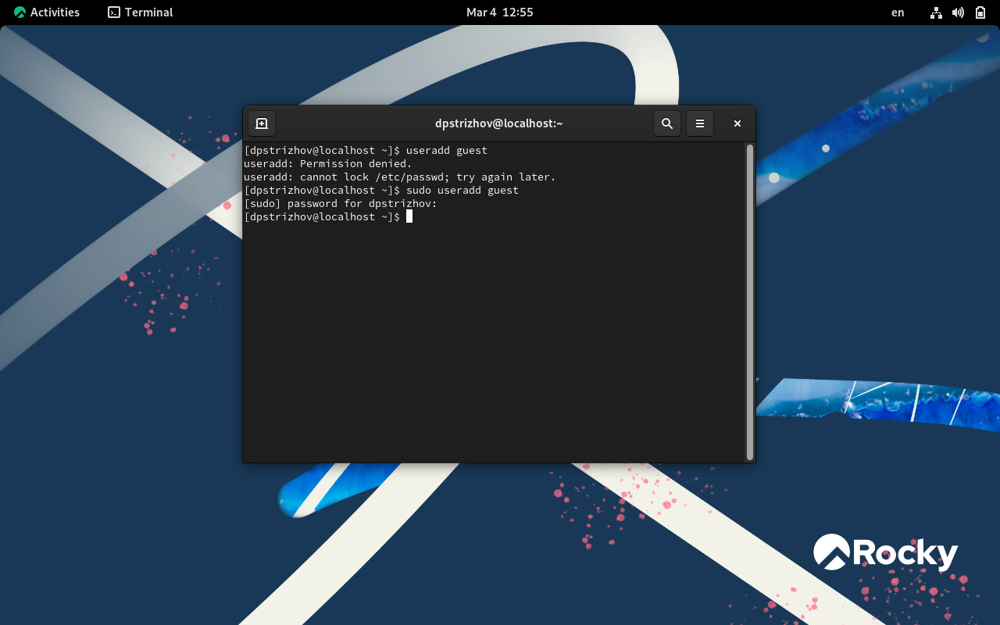
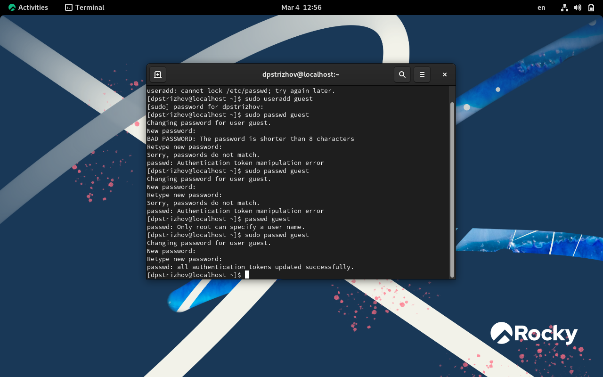
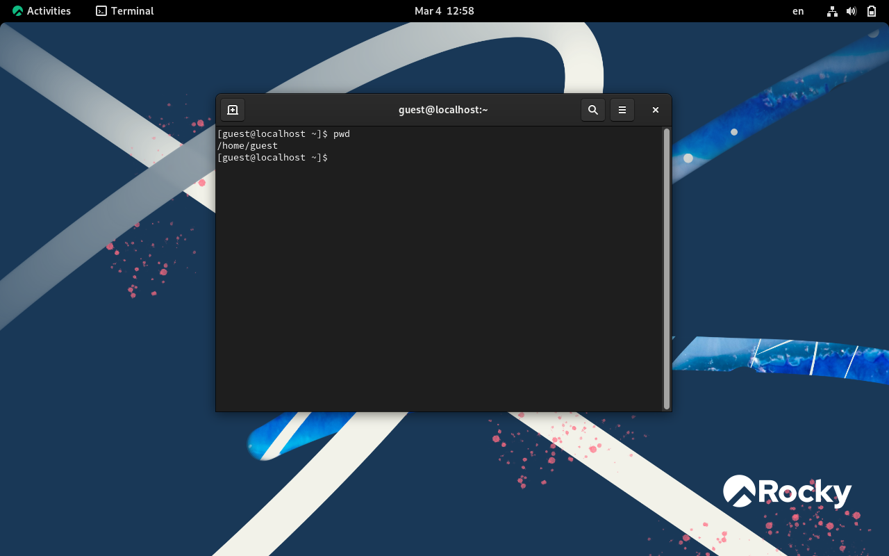
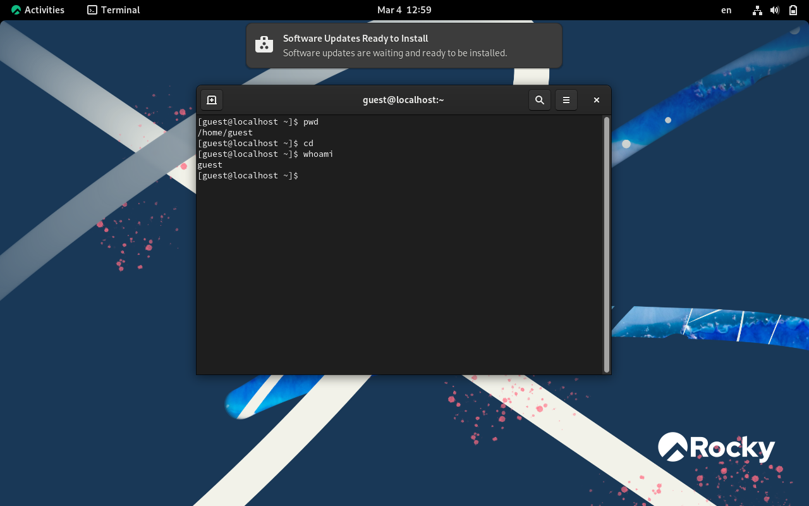
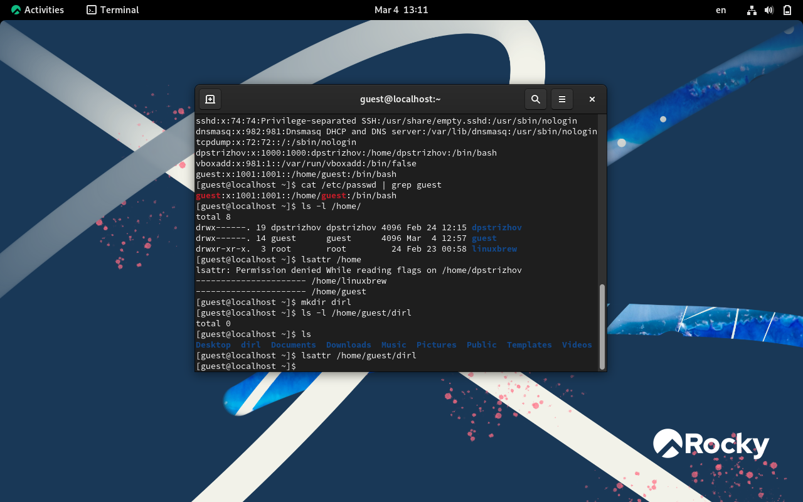
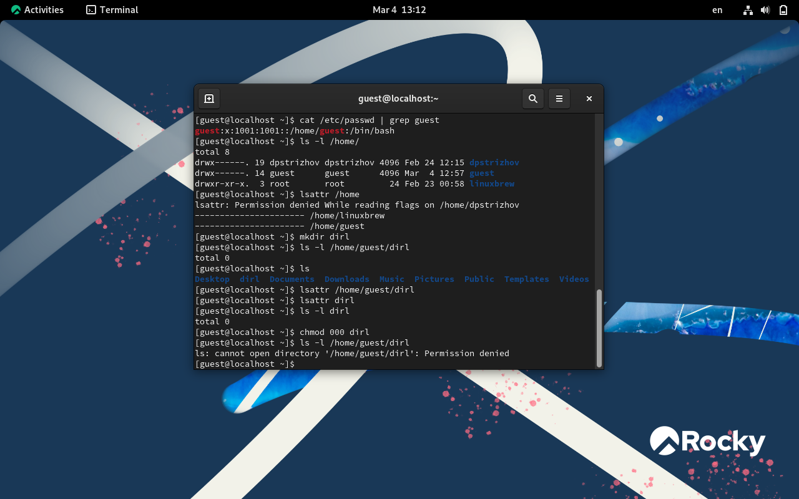
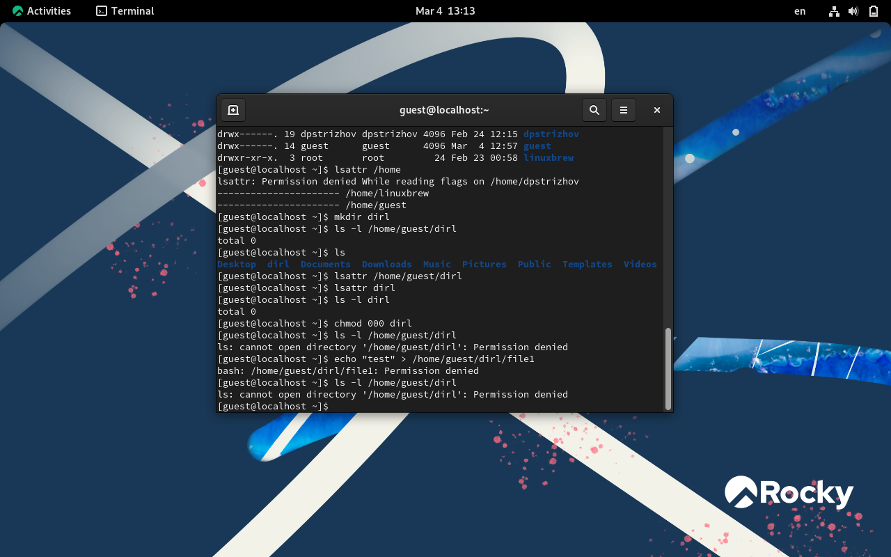

---
## Front matter
lang: ru-RU
title: Презентация по лабораторной работе №2
subtitle: Информационная безопасность			
author:
  - Стрижов Дмитрий Павлович
institute:
  - Российский университет дружбы народов, Москва, Россия
  - НКАбд-04-23
date: 4 марта 2025

## i18n babel
babel-lang: russian
babel-otherlangs: english

## Formatting pdf
toc: false
toc-title: Содержание
slide_level: 2
aspectratio: 169
section-titles: true
theme: metropolis
header-includes:
 - \metroset{progressbar=frametitle,sectionpage=progressbar,numbering=fraction}
---

## Докладчик

:::::::::::::: {.columns align=center}
::: {.column width="70%"}

  * Стрижов Дмитрий Павлович
  * Студент
  * НКАбд-04-23
  * Российский университет дружбы народов
  * [1132236054@pfur.ru](mailto:1132236054@rudn.ru)

:::
::: {.column width="30%"}

:::
::::::::::::::

## Цели и задачи

Целью работы является преобретение навыков работы в консоли с атрибутами файлов и получение информации о разграничении доступа в системе Linux

# Выполнение лабораторной работы

## Создаю пользователя с именем guest 

## Создаю пароль для данного пользователя 

## Вхожу в систему с другим пользователем и определяю директорию, в которой я нахожусь. Приглашение командной строки совпадает с директорией

## Уточняю имя пользователя 

## Уточняю информацию о пользователе с помощью команды id, название группы совпадает с названием группы, выводимым командой groups 

## Нахожу информацию о пользователе в файле /etc/passwd uid пользователя и его gid совпадают 

## Определяю существующие в системе директории. Удалось получить список поддиректорий /home/, среди них созданные нами пользователи и администратор. Права доступа следующие: dpstrizhov имеет полный доступ к файлам, которые сам создает, группы и другие пользователи не имеют права доступа, аналогичные права у guest, у root имеют права на чтение и выполнение операций группы собственников и другие пользователи 

## Проверяю установенные расширенные атрибуты. Удалось узнать о расширенных атрибутах всех пользователей, кроме dpstrizhov, так как у пользователя guest нет к нему доступа

## Создаю директорию dirl и проверяю её 

## Лишаем директории всех атрибутов и проверяем выполнение команды 

## Пытаюсь просмотреть, что находится в директории, не получается, пытаюсь создать файл в директории, он не создатся 

## Выводы

Цель работы была достигнута и навыки были получены.

