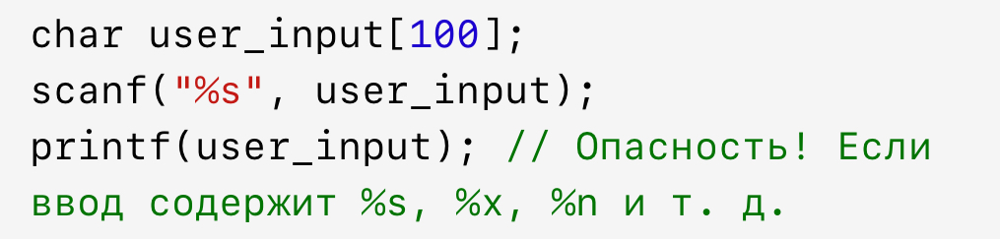
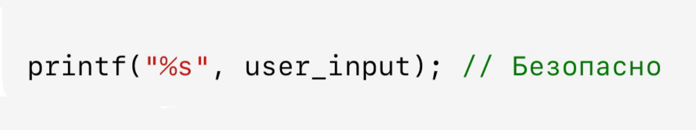
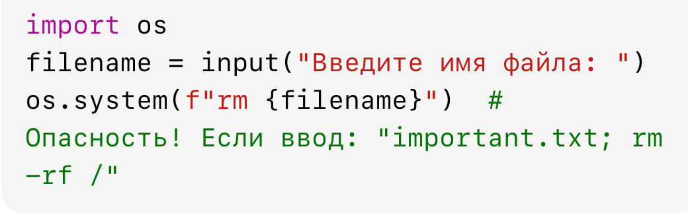

---
## Front matter
lang: ru-RU
title: "Доклад на тему 'Ошибки проверки вводимых данных: ошибки форматирующей строки, неверная поддержка интерпретации метасимволов командной оболочки'"
subtitle: "Основы информационной безопасности"
author: 
  - "Самарханова Полина Тимуровна"
  - НКАбд-04-23
institute:
  - Российский университет дружбы народов, Москва, Россия
date: 13 мая 2025 г.

## i18n babel
babel-lang: russian
babel-otherlangs: english

## Formatting pdf
toc: false
toc-title: Содержание
slide_level: 2
aspectratio: 169
section-titles: true
theme: metropolis
header-includes:
 - \metroset{progressbar=frametitle,sectionpage=progressbar,numbering=fraction}
---

## Введение

Проверка вводимых данных — критически важный этап разработки безопасного и надежного программного обеспечения. Ошибки на этом этапе могут привести к уязвимостям, таким как переполнение буфера, SQL-инъекции, выполнение произвольного кода и другие атаки.  

## Введение

Сегодня мы рассмотрим два типа ошибок проверки ввода:  
1. Ошибки форматирующей строки (Format String Vulnerabilities).  
2. Неверная поддержка интерпретации метасимволов командной оболочки (Shell Metacharacter Injection)

## 1. Ошибки форматирующей строки 

Что это?  
Уязвимости форматирующей строки возникают, когда программа использует пользовательский ввод как часть строки формата в функциях типа printf, sprintf, fprintf без должной проверки.  
Пример опасного кода (на C)(рис 1)

Если злоумышленник введет '%x %x %n', функция printf начнет читать данные из стека и может записать произвольные значения в память (`%n`). 

## 1. Последствия
- Чтение памяти процесса (утечка данных).  
- Запись в память (возможность выполнения кода).  
- Краш программы. 

Чтобы избежать, нужно всегда использовать ститистическую строку(рис 2)

## 2. Неверная поддержка интерпретации метасимволов командной оболочки  

Что это?  
Когда программа передает пользовательский ввод напрямую в командную оболочку (например, через system() в C или subprocess в Python), специальные символы (`;`, |, &&, >, `$()`) могут изменить логику выполнения команды. Пример уязимости (рис 3):

Злоумышленник может ввести команду, которая удалит все файлы

## 2. Последствия
- Выполнение произвольных команд.  
- Эскалация привилегий.  
- Потеря данных.  

Чтобы избежать:
- Экранирование метасимволов (например, shlex.quote в Python).  
- Использование API с параметризованными запросами (например, subprocess.run с отдельными аргументами).  
- Валидация ввода (белые списки разрешенных символов).  

## Заключение

Ошибки проверки ввода — распространенная причина уязвимостей. Чтобы избежать проблем:  
- Всегда проверяйте и санируйте пользовательский ввод.  
- Используйте безопасные функции (`printf` с жестким форматом, subprocess вместо `os.system`).  
- Применяйте принцип минимальных привилегий.  

Безопасная обработка ввода — залог надежности вашего ПО!  

# Спасибо за внимание!
