---
## Front matter
lang: ru-RU
title: Структура научной презентации
subtitle: Простейший шаблон
author:
  - Кулябов Д. С.
institute:
  - Российский университет дружбы народов, Москва, Россия
  - Объединённый институт ядерных исследований, Дубна, Россия
date: 01 января 1970

## i18n babel
babel-lang: russian
babel-otherlangs: english

## Formatting pdf
toc: false
toc-title: Содержание
slide_level: 2
aspectratio: 169
section-titles: true
theme: metropolis
header-includes:
 - \metroset{progressbar=frametitle,sectionpage=progressbar,numbering=fraction}
---

# Информация

## Докладчик

:::::::::::::: {.columns align=center}
::: {.column width="70%"}

  * Кулябов Дмитрий Сергеевич
  * д.ф.-м.н., профессор
  * профессор кафедры прикладной информатики и теории вероятностей
  * Российский университет дружбы народов
  * [kulyabov-ds@rudn.ru](mailto:kulyabov-ds@rudn.ru)
  * <https://yamadharma.github.io/ru/>

:::
::: {.column width="30%"}

:::
::::::::::::::

# Вводная часть

## Цель работы

Установить ОС Kali Linux

## Задание

1. Установить Kali Linux

# Выполнение лабораторной работы

#Пишу название виртуальной машины и выбираю нужный образ диска, выбираю папку, в которой будет находится ВМ 

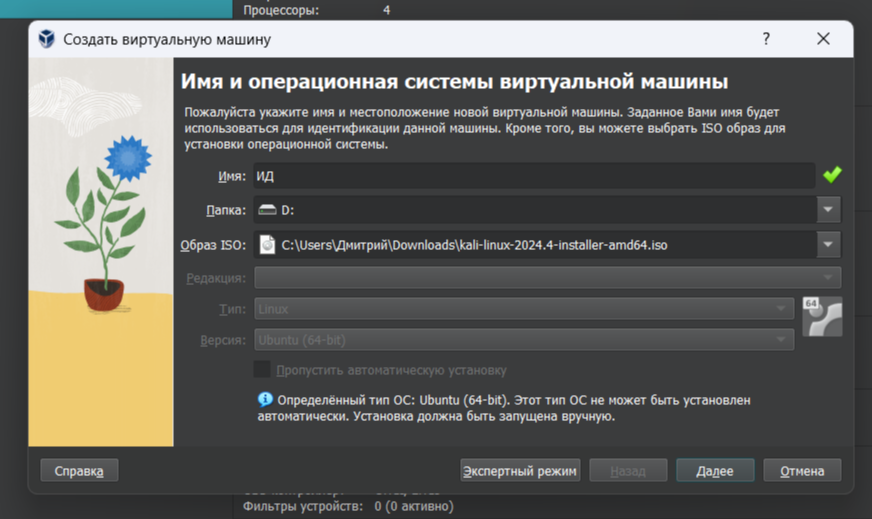

## Указываю нужное количество ОП и ядер процессора

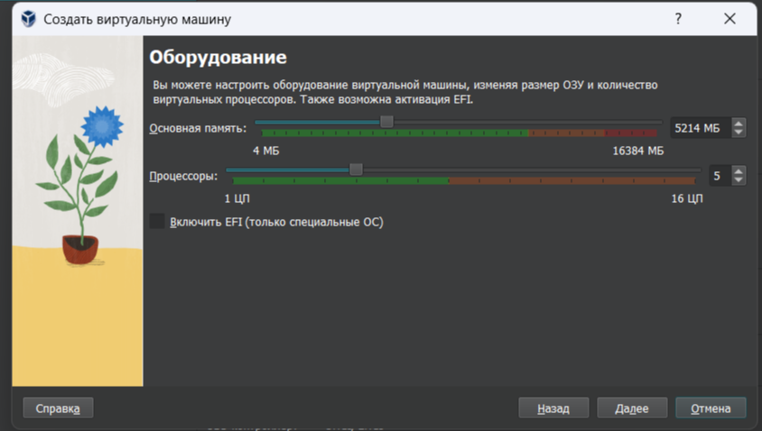

## Указываю размеры диска 

## Указываю нужный язык системы 

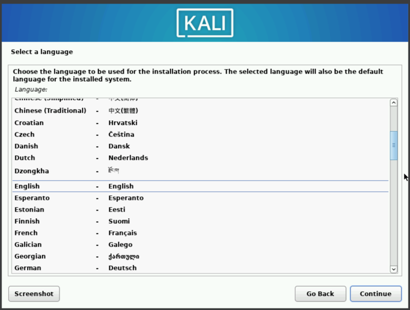

## Указываю нужное местоположение 

## Настраиваю клавиатуру 

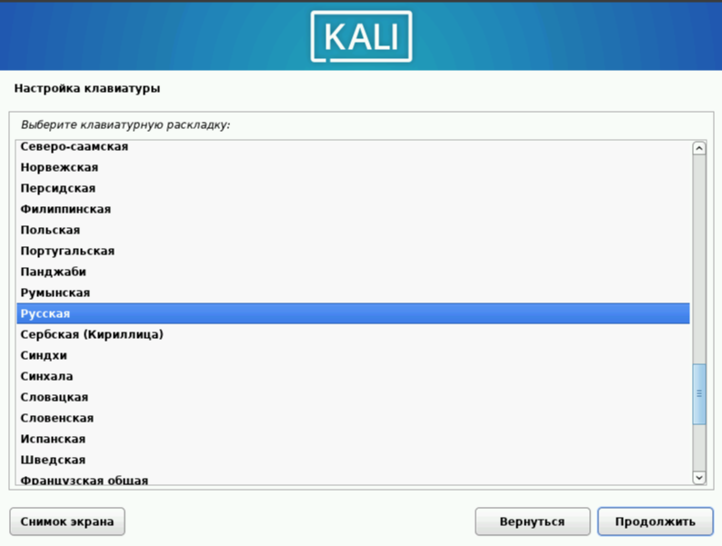

## Выбираю комбинацию для смены языка 

## Вписываю имя пользователя 

## Вписываю имя домена 

## Указываю имя пользователя, у которого будут root-права 

## Имя пользователя, под которым я буду известен в системе 

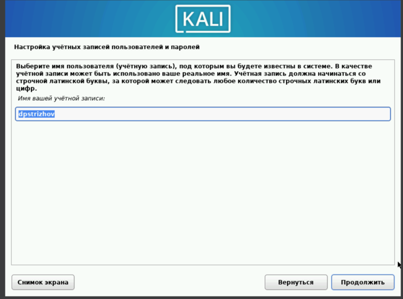

## Выбираю диск для разметки 

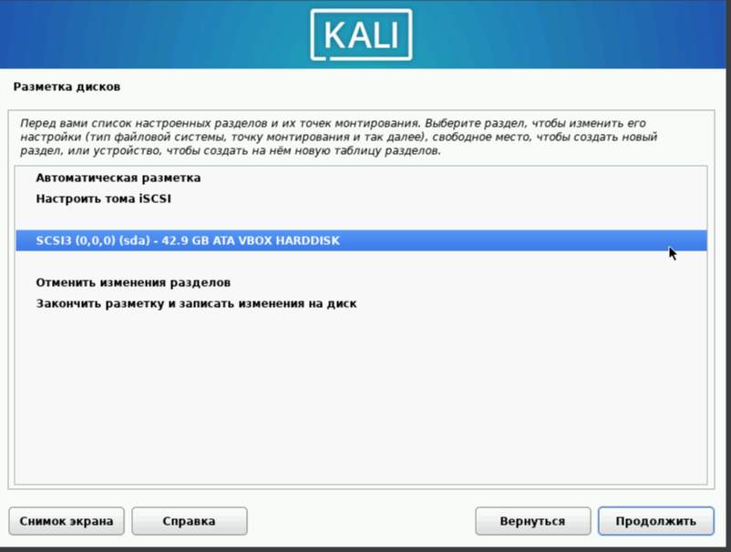

## Заканчиваю разметку диска 

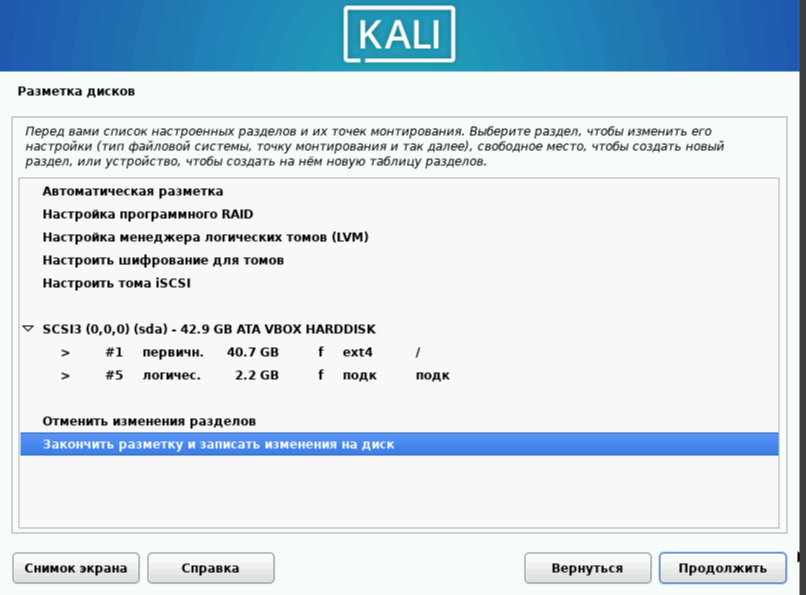

## Подтверждаю завершение разметки дисков 

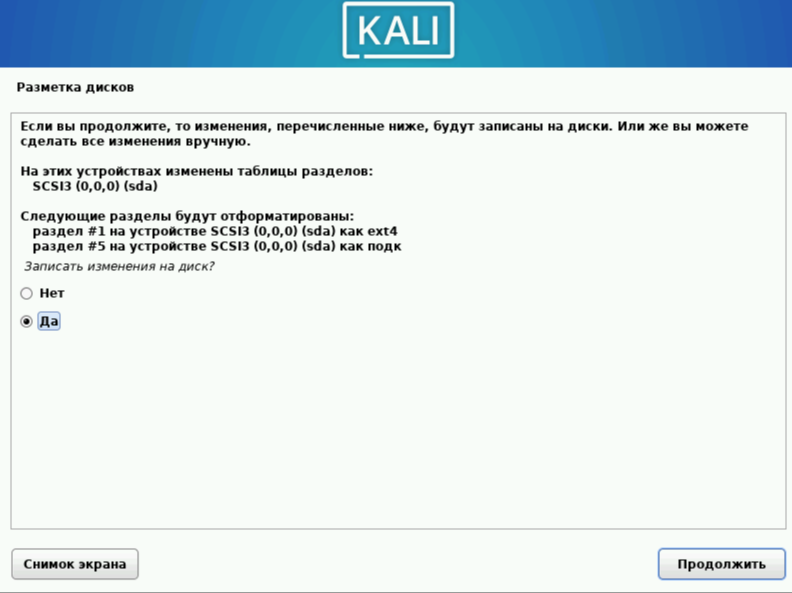

## Выбираю нужное програмное обеспечение 

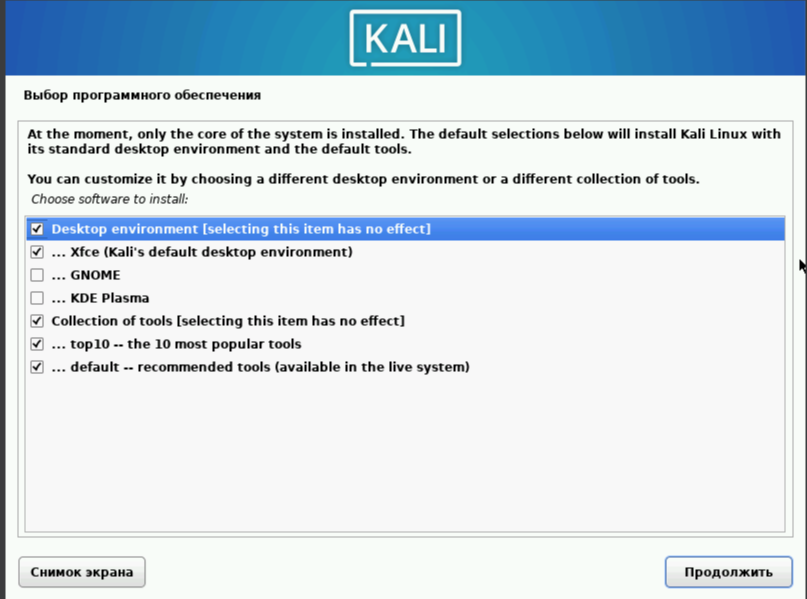

## Выбираю место для загрузчика 

## Завершаю установку 

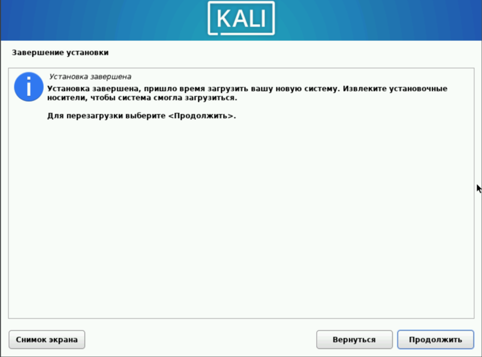

## Вхожу в систему 

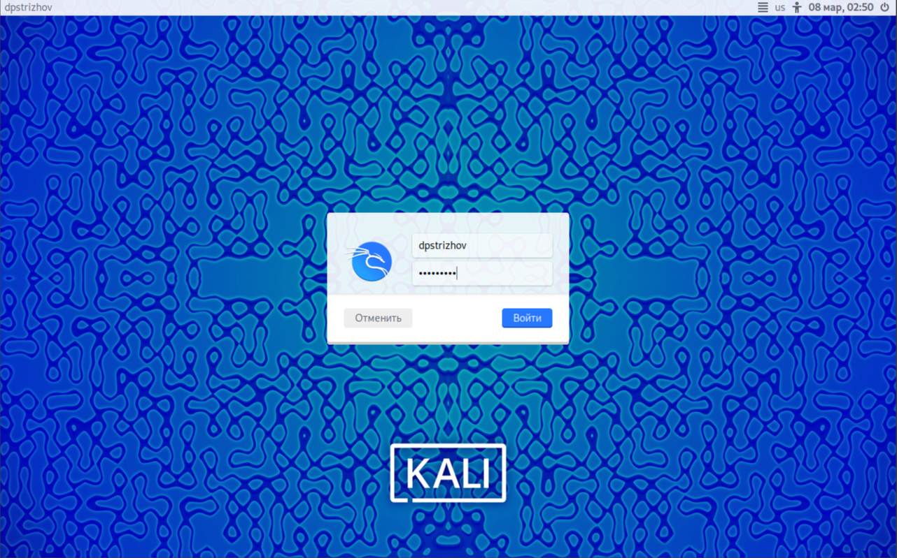

## Вижу, что ОС утсановалась правильно 

## Выводы

Операционная система установлена.
